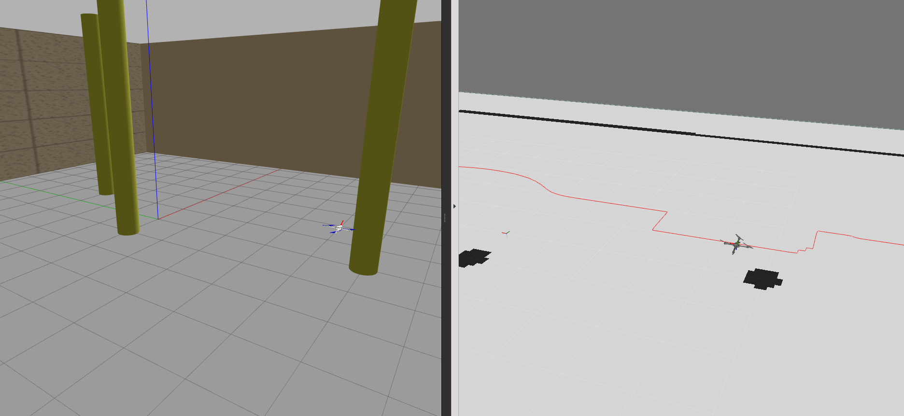

# Motion planning and control for VTOL UAV 
This is the technical project for the Field and Service Robotics exam, at
University Federico II of Naples.



## Introduction
The aim of this project is to develop a system able to perform motion planning
and control for a **VTOL UAV**. In particular, an *AscTec Hummingbird*
quadcopter has been considered; however, the system can work with any
other UAV.

Motion planning is performed via **artificial potential** method, with a
**navigation function**-based algorithm to avoid local minima.
The control is achieved through a **passivity-based hierarchical controller**.


## Download and compile
This is a ROS package. You can download the content of this repository in your
workspace, and compile it using catkin_make. Before to compile, be sure to
install all the dipendencies listed below.

```
    $ git clone https://github.com/micmarolla/smart_warehouse_world
    $ catkin_make
```

**Please note**: it is possible that the package will not compile on the first
attempt. This is due to a weird behaviour of catkin_make, that compiles custom
msgs *after* the nodes. To solve this problem, open
[quad_control/CMakeLists.txt](quad_control/CMakeLists.txt), comment out the
lines (164 - 178), and compile: this will only compile the messages. Then,
uncomment those lines and compile again. This issue could be solved using
another package that only contains the messages.


### Dependencies
This project has been developed and tested on Ubuntu 18.04 LTS, with ROS Melodic
and Gazebo 9.0. It *could* work also on the newest versions of the softwares,
but this has not been tested and thus is not guaranteed.

Besides basic ros and gazebo packages, you also need to install the following
ones:

```
    ros-melodic-octomap
    ros-melodic-octomap-msgs
    ros-melodic-octomap-ros
    ros-melodic-mavlink
    ros-melodic-mavros
    ros-melodic-mav-msgs
    ros-melodic-map-server
    libgoogle-glog-dev
```


## Play the scene
In order to play the provided scene, use the main launch file:
```
    roslaunch quad_control main.launch
```

## Create your own scene
You can use any Gazebo scene in this project: you can modify the room size and
add new objects. You can create the scene from scratch, or start modifying the
provided one, using:

```
    roslaunch quad_control scene.launch
```

To include your own scene, a corresponding 3D octomap and 2D
occupancy grid must be generated, and the world_name parameter in the launch
file needs to be set accordingly.

First, create the scene you want in Gazebo. To generate a 3D octomap, use:

```
    roslaunch quad_control buildOcto.launch world_name:=<your_world_name>
```

Then, to generate a 2D occupancy grid use:
```
    roslaunch quad_control buildMap.launch world_name:=<your_world_name>
```

Finally, call the script fixMap.py inside the *script* directory as:
```
    python fixMap.py <your_world_name>
```

You're now ready to use your own scene in the project. Just set the world_name
arg in the main.launch file.


## In detail documentation
In the doc folder you can find [a detailed report](quad_control/doc/Report.pdf)
on the project and [a video demonstration](quad_control/doc/video.mp4).
